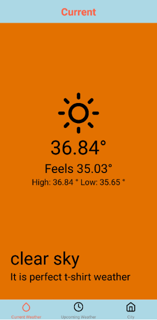

  
  

# Weather App

## Description
The Weather App is a simple mobile application built with React Native that allows users to check the weather conditions of their location.

## Features
- Displays current weather information including temperature, humidity, wind speed, and description.
- Provides a 5-day 3-hour forecast with daily temperature and weather conditions.
- Automatically detects and displays weather based on the user's current location.
- Simple and intuitive user interface.

## Installation
1. Clone the repository: `git clone https://github.com/your-username/weather-app.git`
2. Navigate to the project directory: `cd weather-app`
3. Install the dependencies: `npm install`

## Usage
1. Start the development server: `npm start`
2. Follow the instructions in the terminal to launch the app on your emulator or physical device.

## Dependencies
- React Native
- React Navigation
- Axios (or any other library for making HTTP requests)
- Moment.js (for date and time formatting)

## Contributing
Contributions are welcome! If you'd like to contribute to the Weather App, please follow these steps:
1. Fork the repository.
2. Create a new branch: `git checkout -b feature/your-feature`
3. Make your changes and commit them: `git commit -m "Add your feature"`
4. Push to the branch: `git push origin feature/your-feature`
5. Open a pull request.

## License
This project is licensed under the [MIT License](LICENSE).

